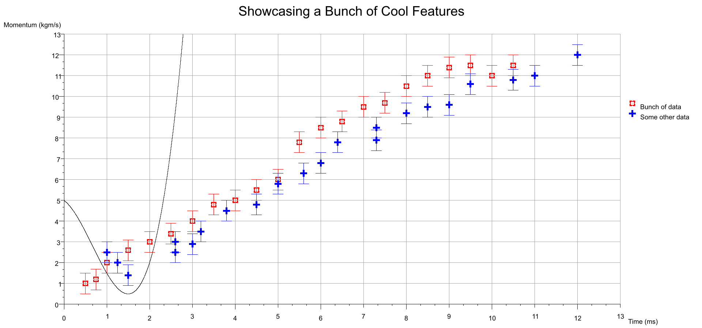
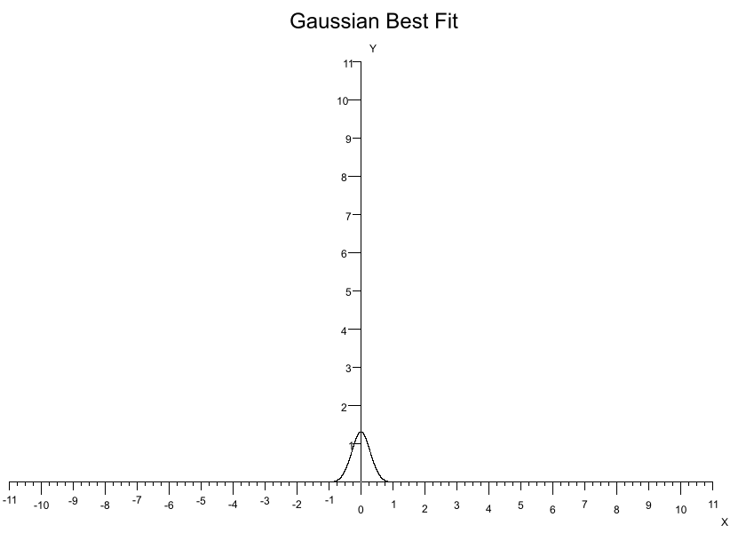
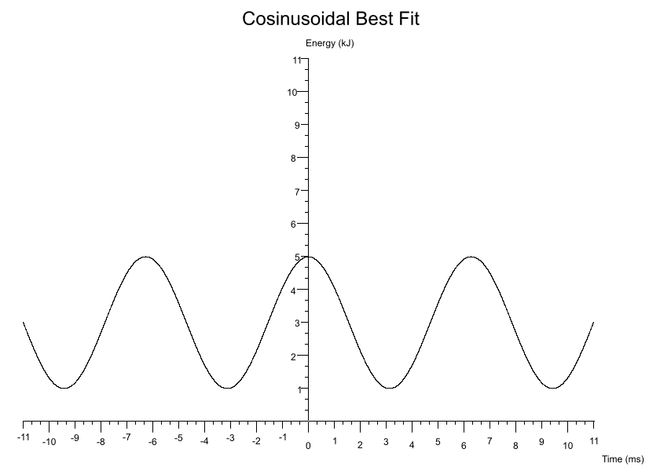
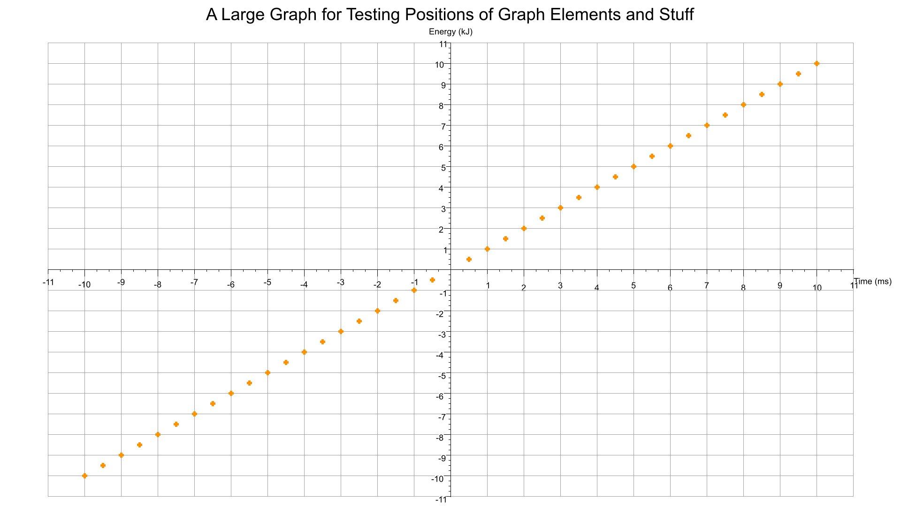
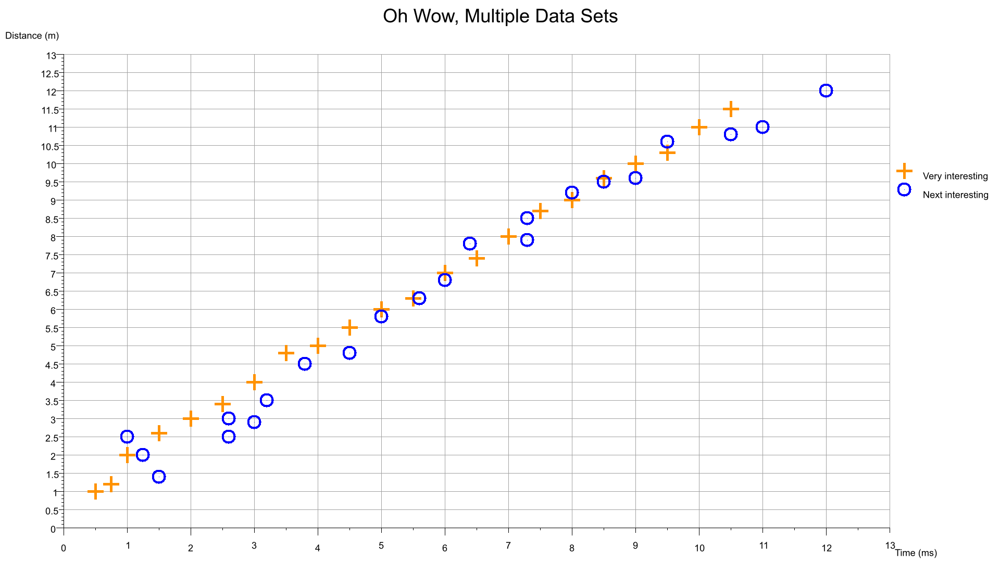
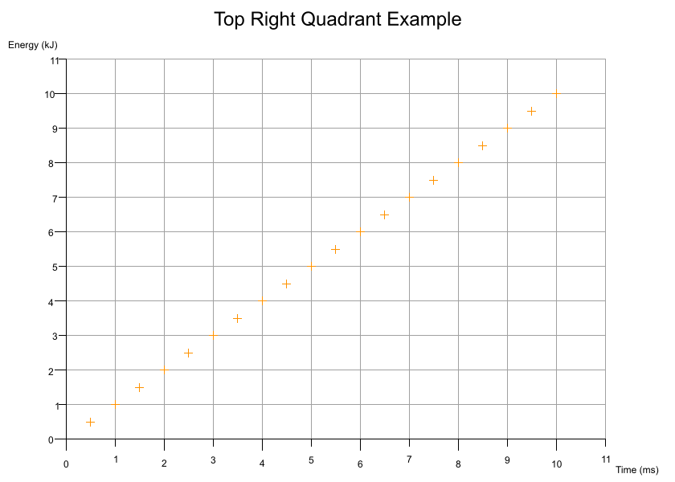
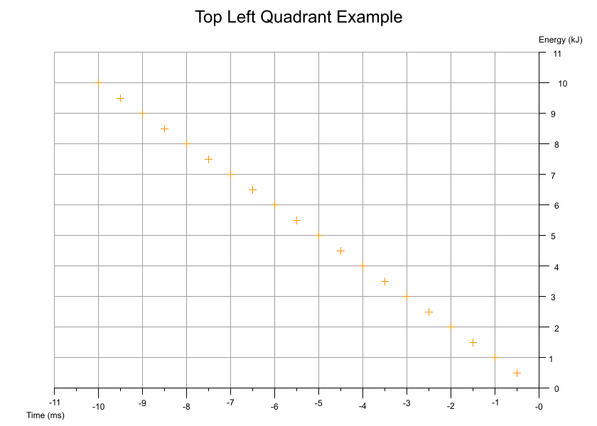
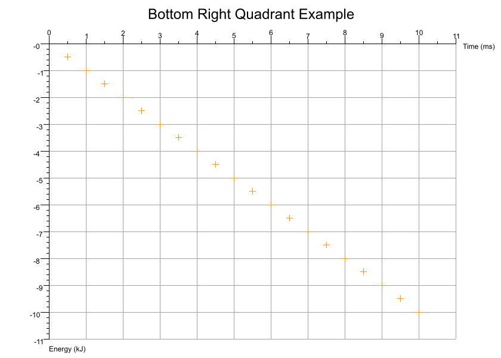
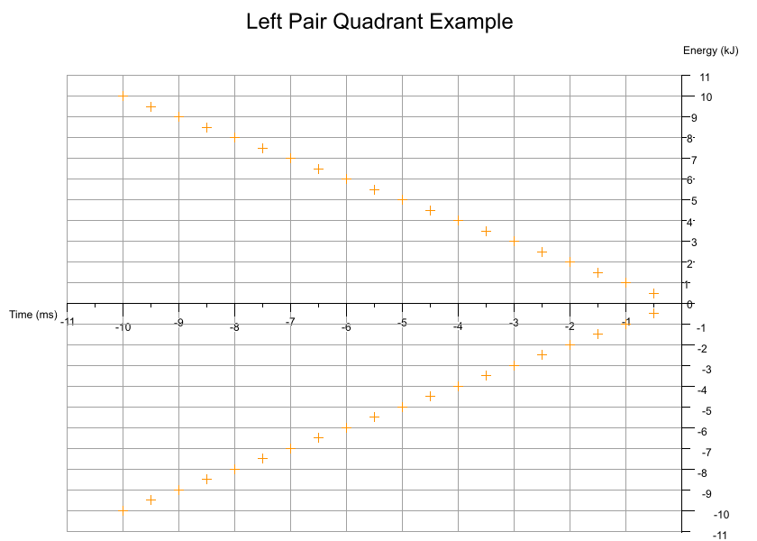
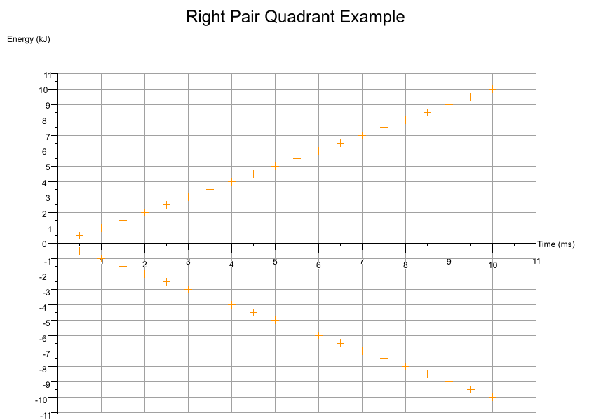

[](https://crates.io/crates/plotrs)
[](https://docs.rs/plotrs)
[](./LICENSE)
[](https://crates.io/crates/plotrs)

# plotrs

A CLI app for plotting csv data sets onto a graph. It works by reading a graph definition from a `.ron` file, then extracts data from one or more csv files and produces a `.png` image. Currently only scatter graphs are supported.



Back in the mists of time I used to use [GNU Octave](https://www.gnu.org/software/octave/index) for plotting data about plasmonic absorption and photovoltaic-thermoelectric currents. As part of my Rust jounrey I thought I'd try writting a program for plotting data points in a similar style.

## Features

* Overlay best fit curves onto your graph
* Graph element/component positions and sizes are dynamically calculated based on the size of the image you want
* Multiple colours and symbols can be used to plot data sets
* Data can be sourced from one or more csv files - you're simply targeting certain columns in a given file for extraction
* Error bars - plot uncertainty in `x` and `y` singly or jointly
* Appropriate quadrants are drawn if your data makes use of negative `x-y` values

## Install

`cargo install plotrs`

## How To Use

Create a `.ron` file containing the configuration of your desired chart and generate a `png` with:

```bash
plotrs -g <graph_type> -c <path_to_config_ron_file> -o <dir_for_output_png>
```

E.g

```bash
plotrs -g scatter -c scatter_config.ron -o here/please
```

Note that if your canvas is too small then your title and axis labels may become blurry.

## Graph `.ron` Schemas

### Scatter Definition

```rust
Scatter(
	title: "Engery against Time for Fuzzing About Things",
	canvas_pixel_size: (840, 600),
	x_axis_label: "Time (ms)",
	x_axis_resolution: 11, // Number of times the x-axis will be divided to show your data scale
	y_axis_label: "Energy (kJ)",
	y_axis_resolution: 11, // Number of times the y-axis will be divided to show your data scale
	has_grid: false, // Should the graph have a light grey background grid
	has_legend: false, // should a legend be generated? Only really useful with multiple data sets
	// data sets can be sourced from the same csv or from different ones and each can be configured with different colours/symbols
	data_sets: [
		DataSet(
			data_path: "scatter.csv",
			has_headers: true, // if your data has headers set to `true` so they can be ignored
			x_axis_csv_column: 0, // which column contains the x values
			x_axis_error_bar_csv_column: None, // which column contains x uncertainty Some(usize) or None
			y_axis_csv_column: 1, // which column contains the y values
			y_axis_error_bar_csv_column: None, // which column contains y uncertainty Some(usize) or None
			name: "Very interesting", // legend will indicate which colour and symbol correspond to which data set
			colour: Orange, // the colour to render a data point
			symbol: Cross, // the shape a plotted data point should take
			symbol_radius: 5, // The size of a drawn symbol in (1+ symbol_radius) pixels
			symbol_thickness: 0, // The thinkness of a drawn symbol in (1 + symbol_thickness) pixels
			best_fit: None, // A curve to fit to the axes. Some(BestFit) or None
		),
	],
)
```

Where your `csv` data may look like (note the lack of whitespace between columns!):

```csv
x,y
0.5,0.5
1.0,1.0
1.5,1.5
```

In a directory you may have:

```txt
- my_config.ron
- data.csv
```

So to generate a `png` you'd run from within the directory `plotrs -g scatter -c my_config.ron` and it'll write a `png` next to the files.

## Symbol Types/Colours

The following symbols can be used for plotting data points:

* Cross
* Circle
* Triangle
* Square
* Point

With the following colours:

* White
* Black
* Grey
* Orange
* Red
* Blue
* Green
* Pink

## [Best Fit Schemas](https://github.com/BlondeBurrito/plotrs/tree/main/examples/scatter_best_fit)

Each data set definition can also specify a Best Fit line to be drawn. In the examples below the data sets are tiny and the symbols are coloured white to hide them in the background canvas, they really just define the extent of the axes to show case overlaying a Best Fit.

### Linear

```rust
y = gradient * x + y_intercept
```

`Some(Linear(gradient: 1.0, y_intercept: 0.0, colour: Black))`


### Quadratic

```rust
y = intercept + (linear_coeff * x) + (quadratic_coeff * x.powf(2))
```

`Some(Quadratic(intercept: 1.0, linear_coeff: 0.0, quadratic_coeff: 1.0, colour: Black))`


### Cubic

```rust
y = intercept + (linear_coeff * x) + (quadratic_coeff * x.powf(2)) + + (cubic_coeff * x.powf(3))
```

`Some(Cubic(intercept: 1.0, linear_coeff: -0.5, quadratic_coeff: 1.0, cubic_coeff: 1.0, colour: Black))`


### Generic Polynomial

For custom polynomials you supply a map of coefficients where each key is the `nth` power `x` will be raised by and the value is the coefficient it'll be multiplied by.

Roughly:

```rust
for (k, v) in coefficients.iter() {
	y += v * x.powf(k);
}
```

The following extends the Cubic best fit into a Quartic Polynomial:

`Some(GenericPolynomial(coefficients: {0: 1.0, 1: 1.0, 2: 1.0, 3: 1.0, 4: -1.0}, colour: Black))`

Which to the human eye kinda looks like: `1 + x + x^2 + x^3 - x^4`.


### Exponential

```rust
y = (constant * base.powf(power * x)) + vertical_shift;
```

`Some(Exponential(constant: 0.5, base: 2.7, power: -1.0, vertical_shift: 3.0, colour: Black))`


### Gaussian

```rust
`y = (variance * (2.0 * PI).sqrt()).powf(-1.0) * E.powf(-(x - expected_value).powf(2.0) / (2.0 * variance.powf(2.0)))`
```

`Some(Gaussian(expected_value: 0.0, variance: 0.3, colour: Black))`



### Sinusoidal

```rust
y = amplitude * ((period * x) + phase_shift).sin() + vertical_shift;
```

`Some(Sine(amplitude: 2.0, period: 1.0, phase_shift: 0.0, vertical_shift: 3.0, colour: Black))`


### Cosinusoidal

```rust
y = amplitude * ((period * x) + phase_shift).cos() + vertical_shift;
```

`Some(Cosine(amplitude: 2.0, period: 1.0, phase_shift: 0.0, vertical_shift: 3.0, colour: Black))`



## Examples

### [Simple Scatter](https://github.com/BlondeBurrito/plotrs/tree/main/examples/scatter)


### [Image Size Scales Elements Dynamically](https://github.com/BlondeBurrito/plotrs/tree/main/examples/scatter_large)

Based on the dimensions of your image (`canvas_size`) the text and axes positions are automatically calculated. You can also toggle a light grey background grid drawn the from axes scales.



### [Scatter Multidata](https://github.com/BlondeBurrito/plotrs/tree/main/examples/scatter_multidata_one_csv)

From single or multiple `csv` files you can plot several data sets onto a single graph. Each data set can be configured to plot with a different colour and/or symbol. The legend can be toggled on and off. The size and thickness of the symbols are configurable on a per data set basis.

From a single `csv` containing multiple columns for different data sets:



From two `csv` files where each contains a column pair:


### [Scatter Error Bars](https://github.com/BlondeBurrito/plotrs/tree/main/examples/scatter_error_bars)

You can also indicate uncertainty with the use of error bars which can be specified for either axes.


### [Quadrants Derived From Data](https://github.com/BlondeBurrito/plotrs/tree/main/examples/scatter_quadrants)

Based on the range of values across a given number of data sets the cartesian quadrants required are determined during exection with scale markings and axis labels moved appropriately.



## Troubleshooting

### The numbers along the axis are long floats overlapping one another

Try changing the `x` and `y` axis resolutions to numbers which are a factor of your largest values + 10%. What happens under the hood is that the largest values in your data set are found and slightly scaled so that data points avoid being plotted directly on an axis and thus obscurring some text/markers. When an axis is drawn it has a certain length in pixels and the resolution decides how many times it gets chopped up to display scale markers. To map a data value (f32) to a pixel (u32) there is a conversion where a single pixel represents some amount or length of value data. For an awkward resolution the pixel length between two scale markers could be a long float rather than rounded whole number.

E.g if the largest `x` value in your data is `10` try setting the `x_axis_resolution` to `10 * 1.1 = 11`, that should produce `11` nice scale markers with whole numbers. Likewise a resolution `22` would produce nice markers also as `11` fits into `22` snugly.

### The title/axis labels/legend are blurry

Try increasing the size of your canvas if the edges of the text become blurry.

## Contributing

* If you're unsure about something raise an issue first
* Fork it
* Tippy tap your keyboard
* Submit a PR

## LICENSE

[Dual license of MIT and Apache](https://github.com/BlondeBurrito/plotrs/blob/main/LICENSE).

## TODO

* Show BestFit types in legend
* Allow overriding font
* checked sub and addition to ensure pixel u32s are not overflowing maybe?
* Split/simplify drawing methods out and then add a billion tests, many around position calculations
* What methods/modules can be reused to draw other graph types...
