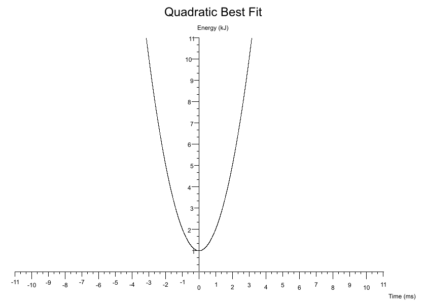
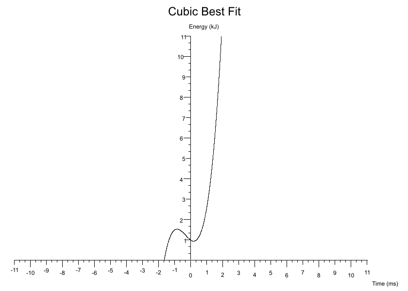
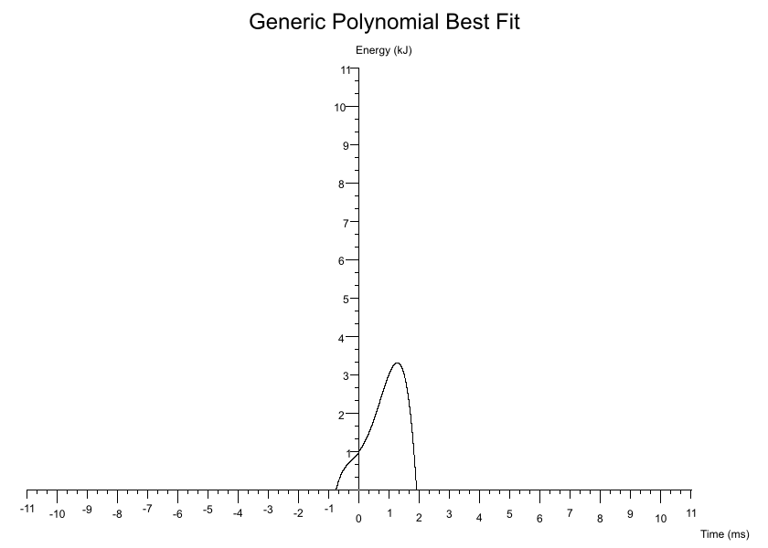
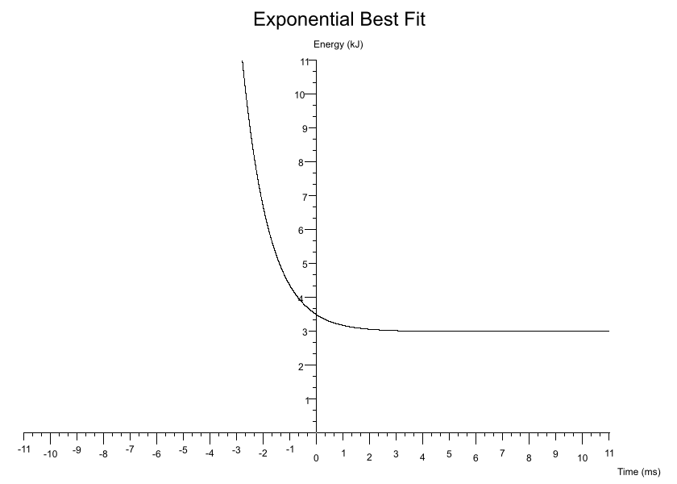
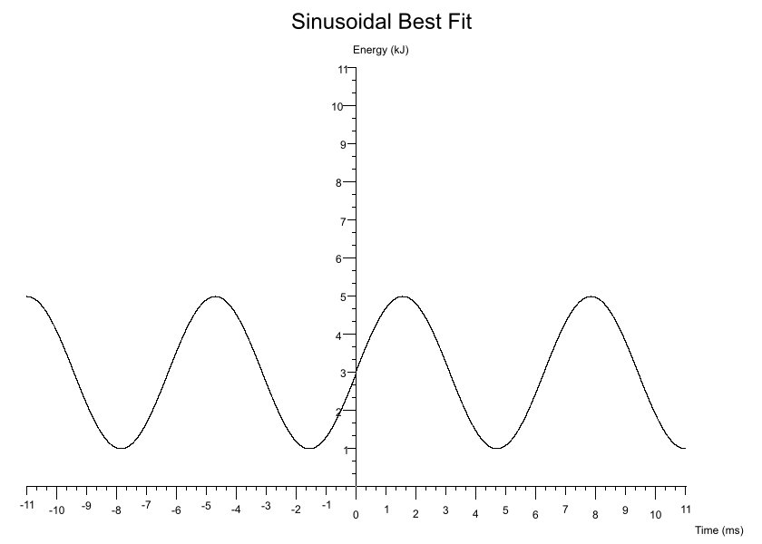

[](https://crates.io/crates/plotit)
[](https://docs.rs/plotit)
[](./LICENSE)
[](https://crates.io/crates/plotit)

todo: license
todo: circle weirdness
todo: negative axes
todo: example for each best fit
todo: revisit expotential approach, check growth and decay funcs

# plotit

A CLI app for plotting data sets onto a variety of graphs.


## Features

## Install

`cargo install plotit`

## How To Use

Controls formatting settings. I have a prefernce for using tabs simply because in shared projects individuals have their own preference for indentation depth and so automatic tab resizing can make a code base gentler on the eyes.

```bash
plotit -g <graph_type> -c <path_to_config_ron_file> -o <dir_for_output_png>
```

E.g

```bash
plotit -g scatter -c examples/scatter/scatter.ron -o examples/scatter
```

Note that if your canvas is too small then your title and axis labels may become blurry.

## Graph `.ron` Schemas

## Symbol Types

## Best Fit Schemas

### Linear

```rust
y = gradient * x + y_intercept
```

`Some(Linear(gradient: 1.0, y_intercept: 0.0, colour: Black))`


### Quadratic

```rust
y = intercept + (linear_coeff * x) + (quadratic_coeff * x.powf(2))
```

`Some(Quadratic(intercept: 1.0, linear_coeff: 1.0, quadratic_coeff: 2.0, colour: Black))`



### Cubic

```rust
y = intercept + (linear_coeff * x) + (quadratic_coeff * x.powf(2)) + + (cubic_coeff * x.powf(3))
```

`Some(Cubic(intercept: 1.0, linear_coeff: -0.5, quadratic_coeff: 1.0, cubic_coeff: 1.0, colour: Black))`



### Generic Polynomial

For custom polynomials you supply a map of coefficients where each key is the `nth` power `x` will be raised by and the value is the coefficient it'll be multiplied by.

Roughly:

```rust
for (k, v) in coefficients.iter() {
	y += v * x.powf(k);
}
```

The following extends the Cubic best fit into a Quartic Polynomial:

`Some(GenericPolynomial(coefficients: {0: 1.0, 1: 1.0, 2: 1.0, 3: 1.0, 4: -1.0}, colour: Black))`



### Exponential

```rust
y = (constant * base.powf(power * x)) + vertical_shift;
```

`Some(Exponential(constant: 0.5, base: 2.7, power: -1.0, vertical_shift: 3.0, colour: Black))`



### Sinusoidal

```rust
y = amplitude * ((period * x) + phase_shift).sin() + vertical_shift;
```

`Some(Sine(amplitude: 2.0, period: 1.0, phase_shift: 0.0, vertical_shift: 3.0, colour: Black))`



### Cosinusoidal

```rust
y = amplitude * ((period * x) + phase_shift).cos() + vertical_shift;
```

`Some(Cosine(amplitude: 2.0, period: 1.0, phase_shift: 0.0, vertical_shift: 3.0, colour: Black))`


## Examples

### [Simple Scatter](https://github.com/BlondeBurrito/plotit/tree/main/examples/scatter)


### [Image Size Scales Elements Dynamically](https://github.com/BlondeBurrito/plotit/tree/main/examples/scatter_large)

Based on the dimensions of your image (`canvas_size`) the text and axes positions are automatically calculated. You can also toggle a light grey background grid drawn the from axes scales.


### [Scatter Multidata](https://github.com/BlondeBurrito/plotit/tree/main/examples/scatter_multidata_one_csv)

From single or multiple `csv` files you can plot several data sets onto a single graph. Each data set can be configured to plot with a different colour and/or symbol. The legend can be toggled on and off. The size and thickness of the symbols are configurable on a per data set basis.

From a single `csv` containing multiple columns for different data sets:


From two `csv` files where each contains a column pair:


### [Scatter Error Bars](https://github.com/BlondeBurrito/plotit/tree/main/examples/scatter_error_bars)

You can also indicate uncertainty with the use of error bars which can be specified for either axes.


## Contributing

## LICENSE

[Dual license of MIT and Apache](https://github.com/BlondeBurrito/plotit/blob/main/LICENSE).
