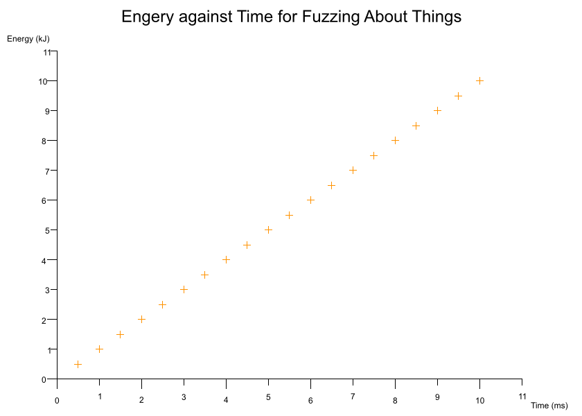
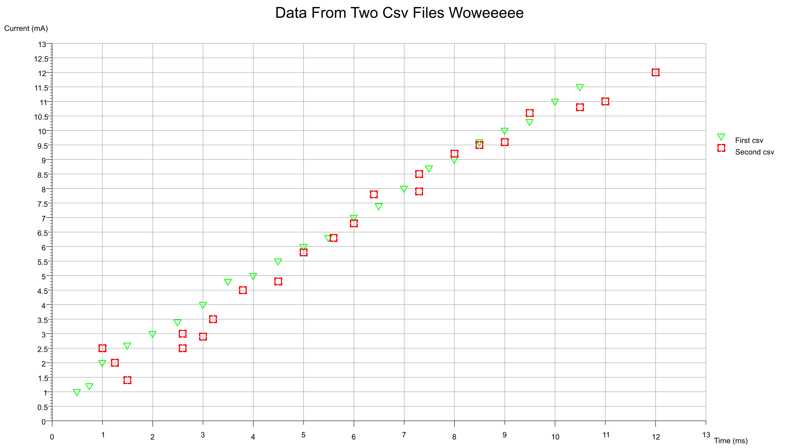

[](https://crates.io/crates/plotit)
[](https://docs.rs/plotit)
[](./LICENSE)
[](https://crates.io/crates/plotit)

# plotit

A CLI app for plotting data sets onto a variety of graphs.

## Features

## Install

`cargo install plotit`

## How To Use

Controls formatting settings. I have a prefernce for using tabs simply because in shared projects individuals have their own preference for indentation depth and so automatic tab resizing can make a code base gentler on the eyes.

```bash
plotit -g <graph_type> -c <path_to_config_ron_file> -o <dir_for_output_png>
```

E.g

```bash
plotit -g scatter -c examples/scatter/scatter.ron -o examples/scatter
```

Note that if your canvas is too small then your title and axis labels may become blurry.

## Graph `.ron` Schemas

## Symbol Types

## Best Fit Schemas

## Examples

### [Simple Scatter](https://github.com/BlondeBurrito/plotit/tree/main/examples/scatter)



### [Image Size Scales Elements Dynamically](https://github.com/BlondeBurrito/plotit/tree/main/examples/scatter_large)

Based on the dimensions of your image (`canvas_size`) the text and axes positions are automatically calculated. You can also toggle a light grey background grid drawn the from axes scales.


### [Scatter Multidata](https://github.com/BlondeBurrito/plotit/tree/main/examples/scatter_multidata_one_csv)

From single or multiple `csv` files you can plot several data sets onto a single graph. Each data set can be configured to plot with a different colour and/or symbol. The legend can be toggled on and off. The size and thickness of the symbols are configurable on a per data set basis.

From a single `csv` containing multiple columns for different data sets:


From two `csv` files where each contains a column pair:



### [Scatter Error Bars](https://github.com/BlondeBurrito/plotit/tree/main/examples/scatter_error_bars)

You can also indicate uncertainty with the use of error bars which can be specified for either axes.


## Contributing

## LICENSE

[Dual license of MIT and Apache](https://github.com/BlondeBurrito/plotit/blob/main/LICENSE).
